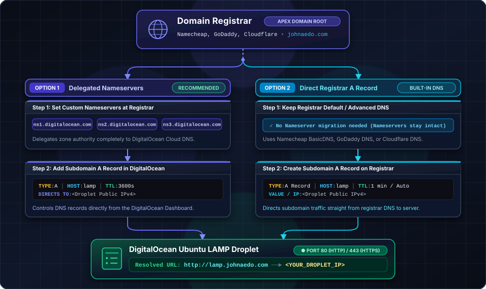
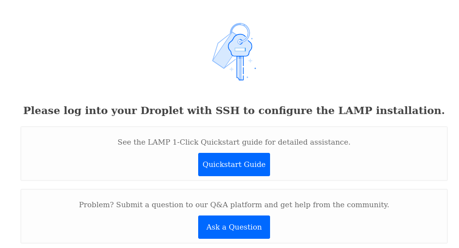

# Tutorial 1: DigitalOcean LAMP Droplet Setup, SSH Authentication & DNS Configuration

Welcome to the COP 4331 LAMP Stack tutorial series! In this first tutorial, you will provision a cloud server (Droplet) on DigitalOcean running a complete LAMP (Linux, Apache, MySQL/MariaDB, PHP) stack. You will configure secure SSH key-based authentication for the `root` administrative user, connect to your server from **Windows Terminal** or **macOS Terminal**, and map your custom domain name to your Droplet using DNS.

---

> [!IMPORTANT]
> **Domain Name Placeholder:**  
> Throughout this tutorial series, we use **`lamp.johnaedo.com`** as the example domain and subdomain.  
> **You must replace `lamp.johnaedo.com` with the domain name you acquired from your domain registrar** (e.g., `lamp.yourdomain.com` or `yourdomain.com`).

---

## 📋 Prerequisites

Before getting started, make sure you have:
1. An active [DigitalOcean Account](https://www.digitalocean.com/). *(Students can use the GitHub Student Developer Pack for free DigitalOcean credits).*
2. A custom registered domain name acquired through a domain registrar (such as Namecheap, GoDaddy, Cloudflare, Porkbun, or Google Domains/Squarespace).
3. A terminal client on your local computer:
   - **Windows 10/11**: **Windows Terminal** (PowerShell or Command Prompt with OpenSSH).
   - **macOS / Linux**: Built-in **Terminal** application.

---

## 🔑 Step 1: Generate an SSH Key Pair Locally

SSH (Secure Shell) keys provide a cryptographic method of authenticating to your remote server without sending plaintext passwords over the network. An SSH key pair consists of two cryptographic keys:
- **Private Key (`id_ed25519`)**: Kept strictly on your local machine. Never share or upload this key.
- **Public Key (`id_ed25519.pub`)**: Uploaded to DigitalOcean and placed on your Droplet's authorized keys list.

### A. On macOS / Linux Terminal

1. Open your **Terminal** application (press `Cmd + Space`, type `Terminal`, and press Enter).
2. Generate an `ED25519` key pair (recommended) or a 4096-bit `RSA` key:
   ```bash
   ssh-keygen -t ed25519 -C "your_email@example.com"
   ```
3. When prompted:
   - `Enter file in which to save the key (/Users/youruser/.ssh/id_ed25519)`: Press **Enter** to accept default path.
   - `Enter passphrase (empty for no passphrase)`: Enter a passphrase for extra protection, or press **Enter** for none.
4. Display and copy your **Public Key**:
   ```bash
   cat ~/.ssh/id_ed25519.pub
   ```
   *Copy the entire output starting with `ssh-ed25519 AAAAC3NzaC... your_email@example.com`.*

### B. On Windows Terminal (PowerShell)

1. Open **Windows Terminal** or **PowerShell** as your standard user.
2. Generate the key pair:
   ```powershell
   ssh-keygen -t ed25519 -C "your_email@example.com"
   ```
3. Press **Enter** to accept the default file location (`C:\Users\<YourUsername>\.ssh\id_ed25519`).
4. Display and copy your **Public Key**:
   ```powershell
   Get-Content $env:USERPROFILE\.ssh\id_ed25519.pub
   ```
   *Copy the full single line of text printed to the console.*

---

## 🚀 Step 2: Create a DigitalOcean LAMP Droplet

Now, we will provision a new virtual machine preloaded with the LAMP stack and install your SSH public key for the `root` superuser.

1. **Log in to DigitalOcean**: Navigate to [cloud.digitalocean.com](https://cloud.digitalocean.com/).
2. In the top-right corner, click **Create** > **Droplets**.
3. **Choose Region / Datacenter**: Select the datacenter geographically closest to you (e.g., *New York (NYC1/NYC3)* or *San Francisco (SFO3)*).
4. **Choose Image**:
   - Click the **Marketplace** tab.
   - Search for and select **LAMP on Ubuntu** (this automatically installs Ubuntu LTS, Apache 2.4, MariaDB/MySQL, and PHP).

5. **Choose Size (Droplet CPU / Memory)**:
   - Select **Basic**.
   - Under *CPU Options*, choose **Regular SSD**.
   - Select the $6.00/mo plan with 1GB RAM / 1 vCPU / 25GB SSD, which is sufficient for this project.

6. **Choose Authentication Method**:
   - Select **SSH Key** (Do NOT choose Password).
   - Click **Add SSH Key** (or **New SSH Key**).
   - In the modal dialog:
     - **SSH Key Content**: Paste the public key string copied in Step 1 (`ssh-ed25519 AAAAC3...`).
     - **Name**: Give it a recognizable name (e.g., `My-Laptop-Key`).
     - Click **Add SSH Key**.
   - Ensure the checkbox next to your added key is selected.

7. **Finalize and Create**:
   - **Quantity**: 1 Droplet.
   - **Hostname**: Give your Droplet a descriptive hostname, e.g., `cop4331-lamp-droplet`.
   - Click the green **Create Droplet** button.

8. **Note Your Droplet's IPv4 Address**:
   - Wait 30–60 seconds while DigitalOcean provisions the instance.
   - Once ready, copy the public **IPv4 Address** displayed in your dashboard (e.g., `165.227.123.45`).

---

## 💻 Step 3: Connect to the Droplet via SSH

Now that the Droplet is active and configured with your SSH key, connect to it as the `root` administrative user.

### A. Connecting from macOS / Linux Terminal

Run the following command, replacing `<YOUR_DROPLET_IP>` with your actual Droplet IP:

```bash
ssh root@<YOUR_DROPLET_IP>
```

*Example:*
```bash
ssh root@165.227.123.45
```

### B. Connecting from Windows Terminal

Open **Windows Terminal** (PowerShell or Command Prompt) and execute:

```powershell
ssh root@<YOUR_DROPLET_IP>
```

*Example:*
```powershell
ssh root@165.227.123.45
```

### First-Time Connection Prompt:
When connecting to a new host for the first time, your terminal will display a security authenticity warning:
```text
The authenticity of host '165.227.123.45 (165.227.123.45)' can't be established.
ED25519 key fingerprint is SHA256:abcd1234efgh5678ijkl....
Are you sure you want to continue connecting (yes/no/[fingerprint])?
```
Type **`yes`** and press **Enter**. Your terminal will store the server's fingerprint in `~/.ssh/known_hosts` and log you directly into the root bash shell:

```text
Welcome to Ubuntu 22.04 LTS (GNU/Linux 5.15.0-x86_64)
root@cop4331-lamp-droplet:~#
```

### Verify LAMP Stack Services on the Droplet
Once connected, run the following commands to verify Apache and MySQL are running:

```bash
# Check Apache Web Server status
systemctl status apache2 --no-pager

# Check MySQL status
systemctl status mysql --no-pager
```

Both services should report `Active: active (running)`.

---

## 🌐 Step 4: Configure DNS for Your Domain

To point your custom domain or subdomain (e.g., `lamp.johnaedo.com`) to your DigitalOcean Droplet, you have two standard options depending on how you manage your DNS records.



---

### Option 1: Managing DNS through DigitalOcean (Recommended)

If you delegate your domain's DNS management to DigitalOcean:

1. **Update Nameservers at your Domain Registrar**:
   - Log in to your domain registrar (e.g., Namecheap, GoDaddy).
   - Go to your domain's **DNS / Nameservers** settings.
   - Switch from "Default DNS" to "Custom DNS" and enter DigitalOcean's three nameservers:
     - `ns1.digitalocean.com`
     - `ns2.digitalocean.com`
     - `ns3.digitalocean.com`
   - Save changes.

2. **Add Your Domain in DigitalOcean Control Panel**:
   - Go to **DigitalOcean** > **Manage** > **Networking** > **Domains**.
   - Enter your base domain name (e.g., `johnaedo.com`) and click **Add Domain**.

3. **Create the Subdomain `A` Record**:
   - In the DNS record editor for your domain:
     - **Record Type**: `A`
     - **HOSTNAME**: `lamp` *(this creates `lamp.johnaedo.com`)*
     - **WILL DIRECT TO**: Select your Droplet from the dropdown (or paste `<YOUR_DROPLET_IP>`).
     - **TTL (Seconds)**: `3600` (or default 3600 seconds).
   - Click **Create Record**.

---

### Option 2: Using Your Domain Registrar's Built-in DNS

If you prefer to keep your nameservers at your domain registrar (e.g. Namecheap Advanced DNS, Cloudflare, GoDaddy DNS):

1. Log in to your domain registrar's management dashboard.
2. Navigate to **Manage Domain** > **Advanced DNS** (or **DNS Management** / **DNS Records**).
3. Click **Add New Record**:
   - **Type**: `A Record`
   - **Host / Name**: `lamp` *(or `lamp.johnaedo.com` depending on registrar interface)*
   - **Value / Target IP**: `<YOUR_DROPLET_IP>` (e.g., `165.227.123.45`)
   - **TTL**: `Automatic` or `1 min` / `5 min` (to speed up initial propagation).
4. Save the record.

---

## 🔍 Step 5: Verify DNS Resolution & Web Access

DNS records typically propagate across global DNS resolvers within 5 to 30 minutes (though it can take up to a few hours depending on TTL).

### A. Test DNS Resolution in Terminal

On your local machine (macOS Terminal or Windows Terminal), test if your domain resolves to the Droplet's IP address:

```bash
# Using ping
ping lamp.johnaedo.com

# Using nslookup
nslookup lamp.johnaedo.com

# Using dig (macOS/Linux)
dig lamp.johnaedo.com +short
```

You should see your Droplet's public IPv4 address returned.

### B. Test in Browser

Open your web browser and navigate to:
```
http://lamp.johnaedo.com
```
*(Remember to replace with your registered domain).*

You should see the default DigitalOcean LAMP landing page confirming HTTP connectivity!  



> [!TIP]
> You can safely ignore the "Please log into your Droplet" text.  You've already logged into the droplet and are well on your way to configuring and deploying your first application.  This is just the default page, which you will remove at the end of the tutorial.

---
## UCF DNS Delays

> [!WARNING]
> If you're on campus, you will experience a much longer delay (24-48 hours) with your domain name being recognized.  This is due to campus IT security policies.  We don't want to accept newly-minted domain names too quickly as they may be spam or malware domains!  If you're planning on demonstrating your new domain on campus, please take this into account.  Register your domains early!

---

## 🎯 Summary & Next Steps

In this tutorial, you accomplished the following:
- Generated a secure SSH key pair on Windows or macOS.
- Provisioned an Ubuntu LAMP Droplet on DigitalOcean authenticated with your SSH public key.
- Connected via SSH through the command line as `root`.
- Configured DNS `A` records to route `lamp.johnaedo.com` to your Droplet's public IP address.

In **[Tutorial 2: Database Design & MySQL Management](./02-database-setup-mysql.md#)**, you will access the MySQL command-line interface on your Droplet, create the `ColorsAppDB` database schema, and seed sample user and color records.
