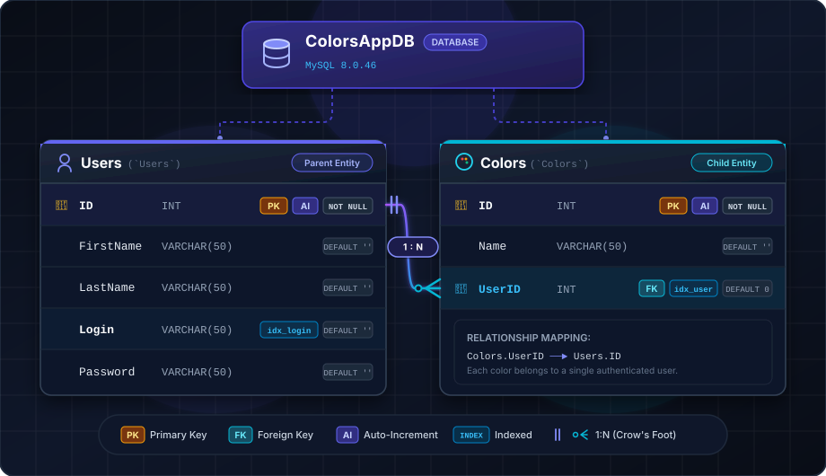

# Tutorial 2: Database Design, MySQL Command-Line Management & Data Seeding

In this second tutorial, you will build out the persistence layer of your LAMP stack. You will log into your DigitalOcean Droplet, interact with the **MySQL** relational database management system using the `mysql` command-line utility, create the `ColorsAppDB` database schema, configure application database user privileges, and execute SQL scripts to seed sample users and color records.

---

> [!IMPORTANT]
> **Domain Name Placeholder:**  
> Throughout this tutorial series, we use **`lamp.johnaedo.com`** as the example domain.  
> **You must replace `lamp.johnaedo.com` with the domain name you acquired from your domain registrar.**

---

## 🏗️ Database Architecture Overview

The database layer for the Colors Manager application is built on **MySQL 8.0.46**. It uses the **InnoDB** storage engine for ACID transaction compliance and row-level locking.



---

## 💻 Step 1: Connect to the Droplet and Launch MySQL CLI

1. Open your local terminal (**Windows Terminal** or **macOS Terminal**) and SSH into your Droplet:
   ```bash
   ssh root@<YOUR_DROPLET_IP>
   ```

2. On Ubuntu LAMP droplets, administrative access to MySQL is managed via the local `auth_socket` authentication plugin for the OS `root` user. Launch the interactive MySQL shell:
   ```bash
   mysql
   ```

3. You will see the MySQL interactive prompt:
   
   ```text
   Welcome to the MySQL monitor.  Commands end with ; or \g.  
Your MySQL connection id is 10  
Server version: 8.0.46-0ubuntu0.24.04.3 (Ubuntu)  
  
Copyright (c) 2000, 2026, Oracle and/or its affiliates.  
  
Oracle is a registered trademark of Oracle Corporation and/or its  
affiliates. Other names may be trademarks of their respective  
owners.  
  
Type 'help;' or '\h' for help. Type '\c' to clear the current input statement.

   mysql>
   ```

### Useful MySQL Interactive Commands:
- `SHOW DATABASES;` — Lists all databases on the server.
- `STATUS;` — Displays server uptime, connection character set, and version.
- `help` — Displays available built-in help commands.
- `EXIT;` or `quit;` — Exits the MySQL prompt back to bash.

---

## 📜 Step 2: Understanding the SQL Scripts

We provide three SQL scripts in a [zip file available here](https://teaching.johnaedo.com/code/cop4331c/lamp/sql-scripts.zip):
1. **`sql/create_tables.sql`**: Creates the database `ColorsAppDB`, `Users` table, `Colors` table, and dedicated application user.
2. **`sql/seed_data.sql`**: Populates `ColorsAppDB` with sample users and color palettes.
3. **`sql/resetdb.sql`**: An all-in-one script that resets the database, rebuilds the schema, and seeds default records in a single operation.

> [!FILES DOWNLOAD]
> [SQL Scripts Zip File Download]('/files/sql-scripts.zip')

### A. Database Schema Breakdown (`sql/create_tables.sql`)

```sql
-- 1. Create the Database with utf8mb4 encoding
CREATE DATABASE IF NOT EXISTS `ColorsAppDB`
    DEFAULT CHARACTER SET utf8mb4
    DEFAULT COLLATE utf8mb4_unicode_ci;

USE `ColorsAppDB`;

-- 2. Create Users Table
CREATE TABLE IF NOT EXISTS `Users` (
    `ID` INT NOT NULL AUTO_INCREMENT,
    `FirstName` VARCHAR(50) NOT NULL DEFAULT '',
    `LastName` VARCHAR(50) NOT NULL DEFAULT '',
    `Login` VARCHAR(50) NOT NULL DEFAULT '',
    `Password` VARCHAR(50) NOT NULL DEFAULT '',
    PRIMARY KEY (`ID`),
    INDEX `idx_users_login` (`Login`)
) ENGINE=InnoDB DEFAULT CHARSET=utf8mb4 COLLATE=utf8mb4_unicode_ci;

-- 3. Create Colors Table
CREATE TABLE IF NOT EXISTS `Colors` (
    `ID` INT NOT NULL AUTO_INCREMENT,
    `Name` VARCHAR(50) NOT NULL DEFAULT '',
    `UserID` INT NOT NULL DEFAULT 0,
    PRIMARY KEY (`ID`),
    INDEX `idx_colors_userid` (`UserID`)
) ENGINE=InnoDB DEFAULT CHARSET=utf8mb4 COLLATE=utf8mb4_unicode_ci;
```

### B. Security & Least Privilege User Creation

> [!WARNING]
> Never configure your web application (PHP) to connect to the database using the `root` administrative account! If your application code is compromised, an attacker would gain full administrative control over all databases on the server.

We create a restricted database user `ColorsAppUser` that can only access `ColorsAppDB`:

```sql
-- Create dedicated application database user
CREATE USER IF NOT EXISTS 'ColorsAppUser'@'localhost' IDENTIFIED BY 'WeLoveCOP4331!';

-- Grant privileges only on ColorsAppDB
GRANT ALL PRIVILEGES ON `ColorsAppDB`.* TO 'ColorsAppUser'@'localhost';

-- Also permit remote connection if needed for Docker containerization
CREATE USER IF NOT EXISTS 'ColorsAppUser'@'%' IDENTIFIED BY 'WeLoveCOP4331!';
GRANT ALL PRIVILEGES ON `ColorsAppDB`.* TO 'ColorsAppUser'@'%';

FLUSH PRIVILEGES;
```

### C. Seed Data Breakdown (`sql/seed_data.sql`)

We insert default users and color palettes for testing:

```sql
USE `ColorsAppDB`;

-- Sample Users
INSERT INTO `Users` (`FirstName`, `LastName`, `Login`, `Password`) VALUES
('Rick', 'Leinecker', 'RickL', 'COP4331'),
('Sam', 'Hill', 'SamH', 'Test'),
('Rick', 'Leinecker', 'RickL_MD5', '5832a71366768098cceb7095efb774f2'),
('Sam', 'Hill', 'SamH_MD5', '0cbc6611f5540bd0809a388dc95a615b');

-- Sample Colors for User 1 (RickL)
INSERT INTO `Colors` (`Name`, `UserID`) VALUES
('Blue', 1), ('White', 1), ('Black', 1), ('Magenta', 1),
('Yellow', 1), ('Cyan', 1), ('Salmon', 1), ('Chartreuse', 1),
('Lime', 1), ('Light Blue', 1), ('Light Gray', 1), ('Light Red', 1),
('Light Green', 1), ('Chiffon', 1), ('Fuscia', 1), ('Brown', 1),
('Beige', 1);

-- Sample Colors for User 3 (RickL_MD5)
INSERT INTO `Colors` (`Name`, `UserID`) VALUES
('Blue', 3), ('White', 3), ('Black', 3), ('Gray', 3),
('Magenta', 3), ('Yellow', 3), ('Cyan', 3), ('Salmon', 3),
('Chartreuse', 3), ('Lime', 3), ('Light Blue', 3), ('Light Gray', 3),
('Light Red', 3), ('Light Green', 3), ('Chiffon', 3), ('Fuscia', 3),
('Brown', 3), ('Beige', 3);
```
---
## ⬆️ Step 3: Uploading the SQL Scripts to the Droplet

In your operating system's terminal program, you can upload the files to your droplet using the `scp` command.  You'll want to be in the same directory as your `sql-scripts.zip` file.

```bash
scp sql-scripts.zip root@<YOUR DROPLET IP>:
```
> [!NOTE]
> Don't forget the `:` at the end!

---

## 🛠️ Step 4: Executing SQL Scripts on the Droplet

You can run SQL scripts on your Droplet using either the MySQL interactive prompt or shell command piping.

### Method 1: Direct Command-Line Pipeline (Fastest)

If you have transferred the SQL file to your Droplet or pasted it into a file (e.g. `/root/resetdb.sql`):

```bash
# Execute the full reset script via standard input redirection
sudo mysql < /root/resetdb.sql
```

### Method 2: Interactive Execution via MySQL Shell

1. Launch MySQL:
   ```bash
   sudo mysql
   ```
2. Run the `SOURCE` command with the absolute path to your SQL script:
   ```sql
   SOURCE /root/resetdb.sql;
   ```
3. MySQL will output:
   ```text
   Query OK, 1 row affected (0.001 sec)
   Database changed
   Query OK, 0 rows affected (0.012 sec)
   Query OK, 4 rows affected (0.003 sec)
   Records: 4  Duplicates: 0  Warnings: 0
   Query OK, 17 rows affected (0.002 sec)
   Records: 17  Duplicates: 0  Warnings: 0
   ...
   ```

---

## 🔍 Step 5: Verifying the Database and Tables

Let's verify that the tables were created and populated correctly.

1. Connect to MySQL using the new application user `ColorsAppUser` to confirm credentials and privileges:
   ```bash
   mysql -u ColorsAppUser -p'WeLoveCOP4331!' -D ColorsAppDB
   ```

2. Inspect the database tables:
   ```sql
   SHOW TABLES;
   ```
   *Expected Output:*
   ```text
   +-----------------------+
   | Tables_in_ColorsAppDB |
   +-----------------------+
   | Colors                |
   | Users                 |
   +-----------------------+
   2 rows in set (0.000 sec)
   ```

3. Check table schema definitions:
   ```sql
   DESCRIBE Users;
   DESCRIBE Colors;
   ```

4. Query the sample users:
   ```sql
   SELECT ID, FirstName, LastName, Login, Password FROM Users;
   ```
   *Expected Output:*
   ```text
   +----+-----------+-----------+-----------+----------------------------------+
   | ID | FirstName | LastName  | Login     | Password                         |
   +----+-----------+-----------+-----------+----------------------------------+
   |  1 | Rick      | Leinecker | RickL     | COP4331                          |
   |  2 | Sam       | Hill      | SamH      | Test                             |
   |  3 | Rick      | Leinecker | RickL_MD5 | 5832a71366768098cceb7095efb774f2 |
   |  4 | Sam       | Hill      | SamH_MD5  | 0cbc6611f5540bd0809a388dc95a615b |
   +----+-----------+-----------+-----------+----------------------------------+
   4 rows in set (0.000 sec)
   ```

5. Query color counts grouped by user:
   ```sql
   SELECT u.Login, COUNT(c.ID) AS TotalColors 
   FROM Users u 
   LEFT JOIN Colors c ON u.ID = c.UserID 
   GROUP BY u.ID;
   ```
   *Expected Output:*
   ```text
   +-----------+-------------+
   | Login     | TotalColors |
   +-----------+-------------+
   | RickL     |          17 |
   | SamH      |           0 |
   | RickL_MD5 |          17 |
   | SamH_MD5  |           0 |
   +-----------+-------------+
   ```

6. Exit the MySQL shell:
   ```sql
   EXIT;
   ```

---

## 💾 Step 6: MySQL Backup & Maintenance (Optional but Recommended)

As a best practice in production operations, you should know how to create logical backups of your database using `mysqldump`:

```bash
# Export full database dump to a timestamped .sql file
sudo mysqldump ColorsAppDB > /root/ColorsAppDB_backup_$(date +%F).sql

# Restore database from backup
sudo mysql ColorsAppDB < /root/ColorsAppDB_backup_*.sql
```

---

## 🎯 Summary & Next Steps

In this tutorial, you accomplished the following:
- Connected to MySQL on your Droplet using the `mysql` CLI.
- Created the relational database schema (`ColorsAppDB`, `Users`, `Colors`).
- Configured a secure, non-root application database user (`ColorsAppUser`).
- Seeded default users (including `RickL` / `COP4331`) and sample color records.
- Verified table structures and query outputs from the command line.

In **[Tutorial 3: Backend RESTful API & Bruno Testing](./03-backend-api-deployment-and-testing.md#)**, you will deploy the PHP REST API to your Droplet, link it to `ColorsAppDB`, and test every endpoint using the Bruno API client.
