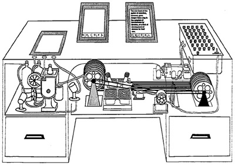
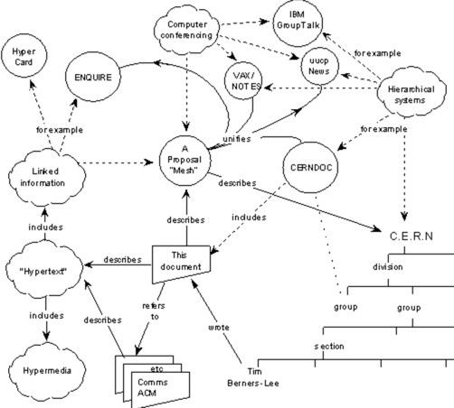
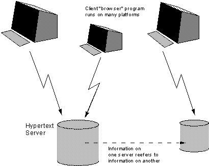
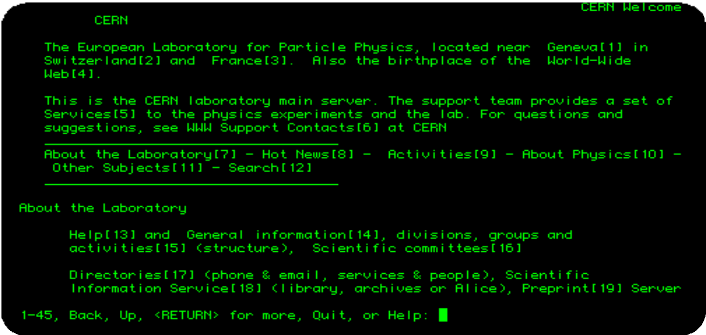
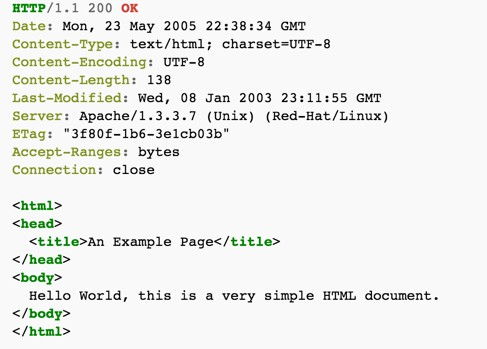
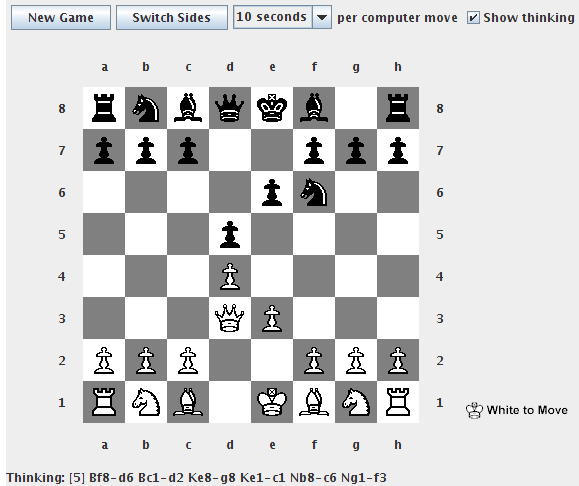
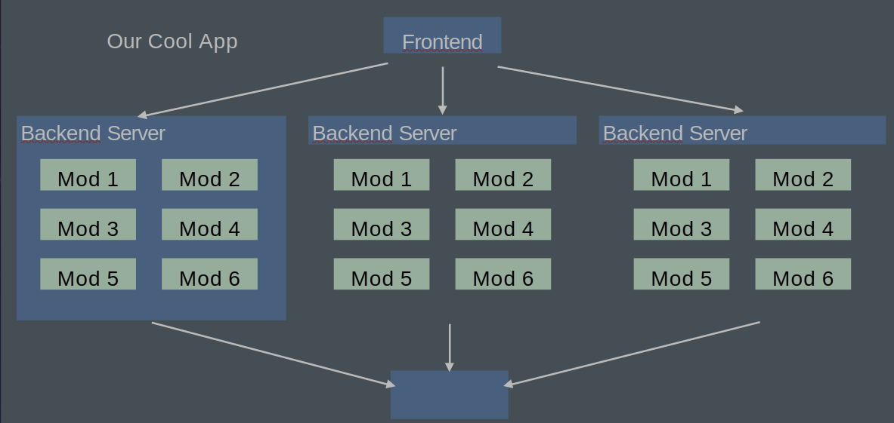

# History of the Web and Overview of Web Architectures


---

## Web Sites vs Web Apps?

- Interactive?
- User-generated content?
- Informational vs fun?

---

## What is the web?

A set of standards: TCP/IP, HTTP, URLs, HTML, CSS, …

A means for distributing structured and semi-structured information to the world

**Infrastructure:** Servers, Networks

---

# Perspectives in Web Development


---

## Systems Perspective

### How can we design robust, efficient, & secure interactions between computers?

### An individual web app may run on:
- Thousands of servers owned and managed by different orgs
- Millions of clients
- \>TBs of constantly changing data

> What happens when a server crashes? How do we prevent a malicious user from accessing user data?

---

## Software Engineering Perspective

### How can we design for change & reuse?

### An individual web app may have:
- Hundreds of developers
- Millions of lines of code
- New updates deployed many times a day
- Much functionality reused from code built by other organizations

> How can a developer successfully make a change without understanding the whole system?

---

## Human-Computer Interaction (HCI) Perspective

### How can we design web apps that are usable for their intended purpose?

### An individual web app may have:
- Millions of users
- Each with a wide variety of needs

> What happens when a new user interacts with the web app? How can we make a web app less frustrating to use?

---

## Pre-Web

*"As We May Think"*, Vannevar Bush — The Atlantic Monthly, July 1945

- Recommended that scientists work on inventing machines for storing, organizing, retrieving and sharing the increasingly vast amounts of human knowledge
- He targeted physicists and electrical engineers — there were no computer scientists in 1945

---

## Pre-Web: Zettelkasten (late 19th, early 20th c.)

German for "slipbox" — an organized cabinet of interlinked notes

- Each note contained organizational metadata: categories, the note's index number, and a list of related note index numbers
- German philosopher Hans Blumenberg was said to have a collection of 30,000 notes
- Still in use today via apps such as Obsidian, Joplin, and Notion


---

## Pre-Web: Memex

**MEMEX = MEMory EXtension**

- Create and follow "associative trails" (links) and annotations between microfilm documents
- Technically based on "rapid selectors" Vannevar Bush built in the 1930s to search microfilm
- Conceptually based on human associative memory rather than indexing



### Never Built :-(

---

## Hypertext and the WWW

- **1965:** Ted Nelson coins "hypertext" (the HT in HTML) — "beyond" the linear constraints of text
- **1968:** Doug Engelbart gives "the mother of all demos" — windows, hypertext, graphics, video conferencing, the mouse, collaborative real-time editor
- **1969:** ARPANET comes online
- **1980:** Tim Berners-Lee writes ENQUIRE, a notebook program which allows links to be made between arbitrary nodes with titles

  

---

## Apple HyperCard — a local, proto-web

Simple, but programmable card filing system included with Macintosh System 6 (1987)

- Allowed for GUI development of interactive elements such as forms and animations using the HyperTalk language
- Each card or stack could be linked to other cards or stacks
- Later evolutions included database integrations and access to the web itself


---

## Origin of the Web

**1989:** Tim Berners-Lee, *"Information Management: A Proposal"*

- Became what we know as the WWW
- A "global" hypertext system full of links (which could be single-directional, and could be broken!)




---

## Early Browsers



---

# Original WWW Architecture

## Nothing but Links!
- The key innovation of HTTP is the linking between documents not only on the same server, but across networks to other servers.
- HTTP is undergirded by the URI/URL and DNS for locating resources across the internet.

---

## URI: Universal Resource Identifier

```
URI: <scheme>://<authority><path>?<query>
     http://cs.ucf.edu/about/about-us
```

| Part      | Example           | Meaning                              |
| --------- | ----------------- | ------------------------------------ |
| scheme    | `http`            | Use HTTP scheme                      |
| authority | `cs.ucf.edu`      | Connect to this host (or IP address) |
| path      | `/about/about-us` | Request this resource                |

Other popular schemes: `ftp`, `mailto`, `file`

>[!TIP]
>More often, you'll see the term URL, Unform Resource Locator, used with respect to web resources.  A URL is a type of URI.  I'm old, so I tend to call everything a URL, but in modern web parlance, it's important to distinguish between a URI and a URL.  URLs belong exclusively to web resources because it specifies a network protocol (the `scheme` above).  URIs are used more generally for identifying objects within broader data domains like books in a library.

More details: https://en.wikipedia.org/wiki/Uniform_Resource_Identifier

---

## DNS: Domain Name System

Domain name system (DNS) (~1982)

- Mapping from names to IP addresses
- E.g. `cs.ucf.edu` → `132.170.216.243`


---

## HTTP: Hypertext Transfer Protocol

High-level protocol built on TCP/IP that defines how data is transferred on the web

**HTTP Request:**
```
GET /about/about-us HTTP/1.1
Host: cs.ucf.edu
Accept: text/html
```

**HTTP Response:**
```
HTTP/1.1 200 OK
Content-Type: text/html; charset=UTF-8
<html><head>...
```

*(Server reads file from disk)*

---

## HTTP Requests

```
GET /about/about-us HTTP/1.1
Host: cs.ucf.edu
Accept: text/html
```

- `GET` — request type. Other popular types: `POST`, `PUT`, `DELETE`, `HEAD`
- `/about/about-us` — the resource
- Request may contain additional header lines specifying client info, form parameters, cookies, etc.
- Ends with a carriage return / line feed (blank line)
- May also contain a message body, delineated by a blank line

---

## HTTP Responses

```
HTTP/1.1 200 OK
Content-Type: text/html; charset=UTF-8

[HTML data]
```

**Response status codes:**
- `1xx` Informational
- `2xx` Success
- `3xx` Redirection
- `4xx` Client error
- `5xx` Server error

**Common MIME types:** `application/json`, `application/pdf`, `image/png`

---

## Properties of HTTP

**Request-response**
- Interactions always initiated by client request to server
- Server responds with results

**Stateless**
- Each request-response pair is independent from every other
- Any state information (login credentials, shopping carts, etc.) needs to be encoded somehow

---

## HTML: HyperText Markup Language

HTML is a **markup language** — a language for describing parts of a document. NOT a programming language.

Tags are added to markup the text, encompassed with `<>`:

```html
<b>This text is bold!</b>
```

Simple markup tags: `<b>`, `<i>`, `<u>` (bold, italic, underline)

---
## The Full Response



---
## Web vs. Internet

| Layer             | Protocols                                              |
| ----------------- | ------------------------------------------------------ |
| Application layer | DNS, FTP, **HTTP**, IMAP, POP, SSH, Telnet, TLS/SSL, … |
| Transport layer   | TCP, UDP, …                                            |
| Internet layer    | IP, ICMP, IPSec, …                                     |
| Link layer        | PPP, MAC (Ethernet, DSL, ISDN, …), …                   |

### **The Web** (HTML, CSS, Browser) sits at the Application layer.

---

## The Modern Web

Evolving competing architectures for organizing content and computation between browser (client) and web server:

| Era | Architecture |
|-----|-------------|
| 1990s | Static web pages |
| 1990s | Server-side scripting (CGI, PHP, ASP, ColdFusion, JSP, …) |
| 2000s | Single page apps (jQuery) |
| 2010s | Front-end frameworks (Angular, React, Vue…), microservices, Internet of Things |
| 2020s | WebAssembly, AI Agents |

---

## Static Web Pages

- URL corresponds to directory location on server  
  e.g. `http://domainName.com/img/image5.jpg` → `img/image5.jpg` on server
- Server responds to HTTP request by returning requested files

**Advantages:** Simple, easily cacheable, easily searchable

**Disadvantages:** No interactivity

---

## Web 1.0 Problems

- At this point, most sites were "read only"
- No rich client content… the best you could hope for was a Java applet:



---
## The Browser Wars
- No standards, every implementation of HTML was different.  Sites often required specific browsers to be viewed.
- Whoever dominated the market effectively set the standard
- Eventually, diversity of browsers demanded some sort of standards:
	- W3C Standards for HTML, CSS and other technologies
	- ECMA Standards for JavaScript (ECMAScript)
	- Frameworks that bridged the gaps between browsers (jquery, mootools)


---

## HTTP: Server-Side Execution

Instead of reading a file from disk, the web server **runs a program**:

**HTTP Request:**
```
GET /about/about-us HTTP/1.1
Host: cs.ucf.edu
Accept: text/html
```

**HTTP Response:**
```
HTTP/1.1 200 OK
Content-Type: text/html; charset=UTF-8
<html><head>...
```

---

## Dynamic Web Pages

```
HTTP Request:
  GET /cop4331c/index.html HTTP/1.1
  Host: cs.ucf.edu
  Accept: text/html

Web Server → Runs a program → Web Server Application
                              → Syllabus Generator Application
                                → "Here's some text to send back"

HTTP Response:
  HTTP/1.1 200 OK
  Content-Type: text/html; charset=UTF-8
  <html><head>...
```

There's a standard mechanism to talk to these auxiliary applications, called **CGI (Common Gateway Interface)**

---

## Server-Side Scripting

Generate HTML on the server through scripts.

Early approaches emphasized embedding server code inside HTML pages.

**Examples:** JavaServer Pages (JSPs), most PHP web code, Active Server Pages (ASPs), ColdFusion
```html
<!DOCTYPE html>
<html lang="en">
<head>
    <meta charset="UTF-8">
    <meta name="viewport" content="width=device-width, initial-scale=1.0">
    <title>Random Luck Generator</title>
</head>
<body>

<?php
$randomNumber = random_int(1, 100);

if ($randomNumber > 95) {
    echo "<h2>You'll have a lucky day! (Number: {$randomNumber})</h2>";
} else {
    echo "<h2>Well, life goes on... (Number: {$randomNumber})</h2>";
}
?>

</body>
</html>
```

---

## Server-Side Scripting Architecture

[Open: Pasted image 20260822223548.png](../_assets/images/Server-Side%20Web%20Architecture.jpg)


---

## Limitations of Server-Side Scripting

**Poor modularity**
- Code representing logic, database interactions, and generating HTML presentation all tangled
- Example of a "Big Ball of Mud" [1]
- Hard to understand, difficult to maintain

Still a step up over static pages!

[1] http://www.laputan.org/mud/

---

## Server-Side Frameworks

Framework that structures server into tiers, organizes logic into classes:

- Create separate tiers for **presentation**, **logic**, and **persistence layer**
- Can understand and reason about domain logic without looking at presentation (and vice versa)

**Examples:** ASP.NET/MVC, Ruby on Rails, Django

---

## Server-Side Framework Architecture
### MVC - Model-View-Controller

[Open: Pasted image 20260822223702.png](../_assets/images/Server-Side%20MVC%20Web%20Architecture.jpg)


---

## Limitations of Server-Side Frameworks

- **Need to load a whole new web page to get new data**
- Users must wait while new web page loads, decreasing responsiveness & interactivity
- If server is slow or temporarily non-responsive, whole user interface hangs!
- Page has a discernible refresh, where old content is replaced and new content appears rather than a seamless transition

---

## Single Page Application (SPA)

- Client-side logic sends messages to server, receives response
- Logic is associated with a single HTML page, written in JavaScript
- HTML elements dynamically added and removed through DOM manipulation
- Processing that does not require the server may occur entirely client-side, dramatically increasing responsiveness & reducing needed server resources

### **Classic example:** Gmail


---

## SPA Enabling Technologies

**AJAX: Asynchronous JavaScript and XML**
- Set of technologies for sending asynchronous requests from web page to server, receiving response

**DOM Manipulation**
- Methods for updating the HTML elements in a page after the page may already have loaded

**JSON: JavaScript Object Notation**
- Standard syntax for describing and transmitting JavaScript data objects
```json
{
	"firstName": "John",
	"lastName": "Smith",
	"age": 25,
	"address": {
		"streetAddress": "123 Main Street",
		"city": "New York",
		"state": "NY",
		"zipCode": "10021-3100"
	},
	"phoneNumbers": [
		{
			"type": "home",
			"number": "212 555-1234"
		},
		{
			"type": "mobile",
			"number": "212 555-4331"
		},
		{
			"type": "office",
			"number": "646 555-4567"
		}
	]
}

```


**jQuery**
- Wrapper library built on HTML standards designed for AJAX and DOM manipulation


https://en.wikipedia.org/wiki/JSON

---

## Single Page Application Architecture

[Open: Pasted image 20260822223825.png](../_assets/images/Server-Side%20Framework%20Architecture.jpg)


---

## Limitations of SPAs

**Poor modularity client-side**
- As logic in client grows increasingly large and complex, becomes "Big Ball of Mud"
- Hard to understand & maintain

**DOM manipulation is brittle & tightly coupled**
- Small changes in HTML may cause unintended changes (e.g., two HTML elements with the same id)

**Poor reuse**
- Logic tightly coupled to individual HTML elements, leading to code duplication of similar functionality in many places

---

## Front-End Frameworks

- Client is organized into separate **components**, capturing model of web application data
- Components are reusable, have encapsulation boundary (e.g., class)
- Components separate logic from presentation
- Components dynamically generate corresponding code based on component state
- In contrast to HTML element manipulation, **a framework generates HTML**, not user code, decreasing coupling

**Examples:** React, Vue, Svelte, Angular, Solid

---

## Front-End Framework Architecture

[Open: Pasted image 20260822224431.png](../_assets/images/Component-Based%20Single%20Page%20Application.jpg)


---

## Limitations of Front-End Frameworks

**Duplication of logic in client & server**
- As clients grow increasingly complex, must have logic in both client & server
- May even need to be written twice in different languages! (e.g., JavaScript, Python)

**Server logic closely coupled to corresponding client logic**
- Changes to server logic require corresponding client logic changes

**Difficult to reuse server logic**

---

## Microservices

Small, focused web server that communicates through data requests & responses

- Focused only on **logic**, not presentation
- Organized around capabilities that can be reused in multiple contexts across multiple applications
- Rather than horizontally scale identical web servers, **vertically scale** server infrastructure into many small, focused servers

---

## Microservice Architecture

[Open: Pasted image 20260822224355.png](../_assets/images/Microservices%20Architecture.jpg)


---

## Architectural Styles

An architectural style specifies:

- How to **partition** a system
- How components **identify and communicate** with each other
- How **information** is communicated
- How elements of a system can **evolve independently**

---

## Constant Change in Web Architectural Styles

**Key drivers:**
- **Maintainability** — new ways to achieve better modularity
- **Reuse** — organizing code into modules
- **Scalability** — partitioning monolithic servers into services
- **Responsiveness** — movement of logic to client
- **Versioning** — support continuous roll-out of new features

Web standards have enabled many possible solutions — explored through many, many frameworks, libraries, and programming languages

---

## The Web Today

- Many technologies for each architectural style; most support more than one
- Applications often evolve from one architectural style to another — leading to applications combining multiple architectural styles
  - e.g., Single page app that uses server-side scripting for a separate set of pages
- Newer architectural styles not always better — more complex, may be overkill for simple sites

---

## Philosophy of the Internet

**Decentralisation:** No permission is needed from a central authority to post anything on the Web — no "kill switch"!

**Non-discrimination:** Net Neutrality — everyone connects at the same quality of service.

**Bottom-up design:** Code developed in full view of everyone, encouraging maximum participation and experimentation.

**Universality:** All computers must speak the same languages, regardless of hardware, location, or cultural/political beliefs.

**Consensus:** Universal standards require everyone to agree — achieved through transparent, participatory processes at W3C.

*From http://webfoundation.org/about/vision/history-of-the-web/*

---

## Internet Governance

**IETF = Internet Engineering Task Force**
- Open, all-volunteer organization
- Organized into working groups on specific topics

**Request for Comments (RFC)**
- One of a series, begun in 1969, of numbered informational documents and standards followed by commercial software and freeware in the Internet and Unix communities
- All Internet standards are recorded in RFCs

---

# A Brief Intro and History of Backend Programming

---

## Why We Need Backends

**Security:** SOME part of our code needs to be "trusted"
- Validation, security, etc. that we don't want to allow users to bypass

**Performance:**
- Avoid duplicating computation (do it once and cache)
- Do heavy computation on more powerful machines
- Do data-intensive computation "nearer" to the data

**Compatibility:**
- Can bring some dynamic behavior without requiring much JS support

---

## Dynamic Web Apps

```
Web "Front End"          "Back End"             Persistent Storage
(Presentation,           (Data storage,          + Some other APIs
 Some logic)              Some other logic)
```

---

## Where Do We Put the Logic?

```
Web "Front End"                    "Back End"
(Presentation, Some logic)         (Data storage, Some other logic)

  Frontend programming               Persistent Storage
  (later in course)      ←──────→    Some other APIs
```

|          | Frontend                                                  | Backend                                                                                     |
| -------- | --------------------------------------------------------- | ------------------------------------------------------------------------------------------- |
| **Pros** | Very responsive (low latency)                             | Easy to refactor across multiple clients; Logic hidden from users (security, compatibility) |
| **Cons** | Security, Performance, Unable to share between front-ends | Interactions require a round-trip to server                                                 |

---

## Why Trust Matters

**Example: Banking app**

Imagine this code runs in the browser:

```javascript
function updateBalance(user, amountToAdd) {
    user.balance = user.balance + amountToAdd;
}
```

**What's wrong?**

**How do you fix that?**

---

## API: Application Programming Interface

Microservice offers a public interface for interacting with backend:

- Offers abstraction that hides implementation details
- Set of **endpoints** exposed on the microservice

```
Microservice API
  GET /cities
  GET /populations

cityinfo.org
```

**Users of the API might include:**
- Frontend of your app
- Frontend of other apps using your backend
- Other servers using your service

---

## Support Scaling

> Yesterday, cityinfo.org had 10 daily active users. Today, it was featured on several news sites and has 10,000 daily active users.

- Yesterday, you were running on a single server. Today, you need more than a single server.

**Can you just add more servers?**

What should you have done yesterday to make sure you can scale quickly today?

---

## Support Change

> Due to your popularity, your backend data provider just backed out of their contract and are now your competitor. The data you have is now in a different format. Also, you've decided to migrate your backend from PHP to node.js to enable better scaling.

**How do you update your backend without breaking all of your clients?**

---

## Support Reuse

> You have your own frontend for cityinfo.org. But everyone now wants to build their own sites on top of your city analytics.

**Can they do that?**

---

## Design Considerations for Microservice APIs

| Concern | Question |
|---------|----------|
| **API** | What requests should be supported? |
| **Identifiers** | How are requests described? |
| **Errors** | What happens when a request fails? |
| **Heterogeneity** | What happens when different clients make different requests? |
| **Caching** | How can server requests be reduced by caching responses? |
| **Versioning** | What happens when the supported requests change? |

---

## REST: REpresentational State Transfer

Defined by Roy Fielding in his 2000 Ph.D. dissertation

- Used by Fielding to design HTTP 1.1 that generalizes URLs to URIs
- http://www.ics.uci.edu/~fielding/pubs/dissertation/fielding_dissertation.pdf

> "Throughout the HTTP standardization process, I was called on to defend the design choices of the Web… I had comments from well over 500 developers, many of whom were distinguished engineers with decades of experience. That process honed my model down to a core set of principles, properties, and constraints that are now called REST."

Interfaces that follow REST principles are called **RESTful**

---

## Properties of REST

- Performance
- Scalability
- Simplicity of a Uniform Interface
- Modifiability of components (even at runtime)
- Visibility of communication between components by service agents
- Portability of components by moving program code with data
- Reliability

---

## Principles of REST

| Principle | Purpose |
|-----------|---------|
| **Client-server** | Separation of concerns (reuse) |
| **Stateless** | Each client request contains all information necessary to service request (scaling) |
| **Cacheable** | Clients and intermediaries may cache responses (scaling) |
| **Layered system** | Client cannot determine if it is connected to end server or intermediary (scaling) |
| **Uniform interface** | A single uniform interface (URIs) simplifies and decouples architecture (change & reuse) |

---

## HTTP: HyperText Transfer Protocol

High-level protocol built on TCP/IP that defines how data is transferred on the web

**HTTP Request:**
```
GET /academics/computer-science-placement-test HTTP/1.1
Host: cs.ucf.edu
Accept: text/html
```

**HTTP Response:**
```
HTTP/1.1 200 OK
Content-Type: text/html; charset=UTF-8
<html><head>...
```

*(Server reads file from disk)*

---

## Uniform Interface for Resources

- Originally files on a web server — URL refers to directory path and file
- But… URIs might be used as an identity for **any entity**:
  - A person, location, place, item, tweet, email, detail view, like
- Does not matter if resource is a file, a database entry, retrieved from another server, or computed on demand
- Resources offer an interface describing what clients can interact with

---

## URI: Universal Resource Identifier

Uniquely describes a resource:

```
https://mail.google.com/mail/u/0/#inbox/157d5fb795159ac0
https://www.amazon.com/gp/yourstore/home/ref=nav_cs_ys
http://gotocon.com/dl/goto-amsterdam-2014/slides/StefanTilkov_REST...pdf
```

**Which is a file, external web service request, or stored in a database?**

It does not matter.

As a client, only the *actions* you can do with a resource matter — not how the resource is represented on the server.

---

## Intermediaries

**HTTP Request:**
```
GET http://api.wunderground.com/api/3bee87321900cf14/conditions/q/VA/Fairfax.json
```

**HTTP Response:**
```
HTTP/1.1 200 OK
Server: Apache/2.2.15 (CentOS)
Access-Control-Allow-Origin: *
Content-Type: application/json; charset=UTF-8
Expires: Mon, 19 Sep 2016 17:38:42 GMT
...

{"response": {"version":"0.1", ...
```

---

## Intermediaries (cont.)

Client interacts with a resource identified by a URI — but it never knows (or cares) whether it interacts with the origin server or an unknown intermediary server.

An intermediary might be:
- Randomly load-balanced to one of many servers
- A cache, so that large files can be stored locally (e.g., GMU caching an OSX update)
- A server checking security and rejecting requests

---

## Challenges with Intermediaries

But can all requests really be intercepted in the same way?

- Some requests might **produce a change** to a resource
  - Can't just cache a response… would not get updated!
- Some requests might **create a change every time** they execute
  - Must be careful retrying failed requests or could create extra copies of resources

---

## HTTP Actions

How do intermediaries know what they can and cannot do with a request?

**Solution: HTTP Actions** — describes what will be done with the resource

| Action | Description |
|--------|-------------|
| `GET` | Retrieve the current state of the resource |
| `PUT` | Modify the state of a resource |
| `DELETE` | Clear a resource |
| `POST` | Initialize the state of a new resource |

---

## HTTP Actions: Safety & Idempotence

| Action | Property | Implication |
|--------|----------|-------------|
| `GET` | **Safe** — no side effects | Requests can be intercepted and replaced with cached response |
| `PUT`, `DELETE` | **Idempotent** — can be repeated with same result | Requests that fail can be retried indefinitely |
| `POST` | **Creates new element** | Retrying a failed request might create duplicate copies |

---

## What Does our Backend Look Like?


```
Web "Front End"  ←(AJAX)→  Our own backend
                               Logic
                               Persistent Data

```

---

## The "Good" Old Days of Backends

```
HTTP Request:
  GET /myApplicationEndpoint HTTP/1.1
  Host: cs.ucf.edu
  Accept: text/html

Web Server → runs a program → Web Server Application
                              → My Application Backend
                                → "Here's some text to send back"

HTTP Response:
  HTTP/1.1 200 OK
  Content-Type: text/html; charset=UTF-8
  <html><head>...
```

---

## What's Wrong with This Picture?

<!-- FIX NEEDED: this slide has no image in any of the three source PPTX
     files — the picture referenced by the title was never attached. Source
     a screenshot of a naive request-per-server backend flow (or reuse the
     CGI text diagram above with a callout) before presenting. -->

---

## History of Backend Development

- In the beginning, you wrote whatever you wanted using whatever language and framework you wanted
	- ...yes, even C!
- Then… **Perl, PHP and ASP** — languages "designed" for writing backends, encouraged spaghetti code. A lot of the web was built on this.
- A whole lot of other languages were also springing up in the 90s: **Ruby, Python, JSP**

---

## Microservices vs. Monoliths

**Advantages of microservices over monoliths:**

| Advantage | Description |
|-----------|-------------|
| **Scaling** | Scale vertically rather than horizontally |
| **Change** | Support hot deployment of updates |
| **Reuse** | Use the same web service in multiple apps; swap internal for external services |
| **Team development** | Pick boundaries that match team responsibilities |
| **Failure** | Independent failure domains |

---

## Support for Scaling: Monolith



```
Our Cool App

Frontend → Backend Server (Mod 1, Mod 2, Mod 3, Mod 4, Mod 5, Mod 6) → Database
```

---

## Now How Do We Scale It?

```
Our Cool App

Frontend → Backend Server 1 (Mod 1–6)  ↘
         → Backend Server 2 (Mod 1–6)  → Database
         → Backend Server 3 (Mod 1–6)  ↗

We run multiple copies of the backend, each with ALL modules!
```

---

## What's Wrong with This Picture?

This is called the **"monolithic" app**

- If we need 100 servers…
- Each server will have to run **EVERY** module
- What if we need more of some modules than others?

---

## Microservices

```
Our Cool App

Frontend → "Dumb" Backend → Todos         (NodeJS, Firebase)
                          → Mailer        (Java, MySQL)
                          → Accounts      (Google Service)
                          → Search Engine (Java, Neo4J)
                          → Analytics     (C#, SQLServer)
                          → Facebook Crawler (Python, Firebase)
```

Each microservice has its own database and technology stack!

---

## Goals of Microservices

- **Add** them independently
- **Upgrade** them independently
- **Reuse** them independently
- **Develop** them independently

➡ Have **ZERO coupling** between microservices, aside from their shared interface
