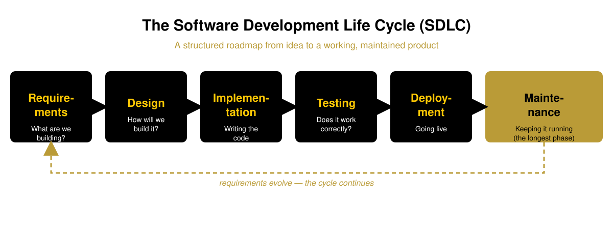
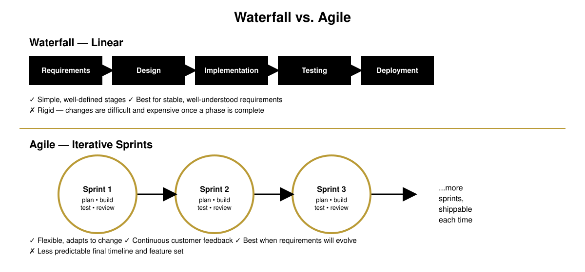

# What Is Software Engineering?
### COP 4331 - Processes of Object Oriented Software Development
University of Central Florida

<small>Based on material by Dr. Richard Leinecker, and Pfleeger & Atlee, *Software Engineering* (4th ed.)</small>

Note:
Welcome / housekeeping. This is lecture 1 of 2 covering the foundations of the course: what software engineering is, why it exists as a discipline, the SDLC, and how quality and methodology shape the way we build software. Lecture 2 covers project-management tooling and UML modeling.

---

## Objectives

By the end of this lecture you should be able to:

- Explain what software engineering is, and how it differs from programming and computer science
- Describe why software needed a "formal discipline" and what happens when it doesn't have one
- Walk through the phases of the Software Development Life Cycle (SDLC)
- Compare Waterfall and Agile as ways of organizing that lifecycle
- Describe multiple perspectives on software **quality**, and why quality matters

Note:
This slide sets expectations. Feel free to skip narrating every bullet — post it and move on.

---

## The World Runs on Software

- **Communication** - social media, email, messaging apps
- **Transportation** - engine controls, GPS, flight control systems
- **Finance** - online banking, trading platforms, ATMs
- **Healthcare** - electronic health records, medical imaging, diagnostics
- **Entertainment** - games, streaming, digital arts

Software isn't a niche technical product anymore - it's critical infrastructure.

---

## Why We Need a Formal Discipline

In the early days of computing (1960s-1980s), software projects were notoriously difficult. Common problems:

- Massively over budget
- Delivered late - or not delivered at all
- Unreliable, full of bugs
- Difficult and expensive to maintain or update

This "software crisis" is what pushed the field toward an **engineering** approach.

Note:
Historically this is sometimes literally called the "software crisis" — worth mentioning by name if there's time.

---

## When It Goes Wrong: A Real Example

**The IRS / Sperry Corporation case (1981-1985):**

- IRS hired Sperry to build an automated federal income-tax processing system which involved both a hardware and software upgrade
	- Honeywell/CDC to Sperry UNIVAC 1100/84
	- Assembly Language to COBOL
- An extra **\$90M** was needed on top of the original $103M contract
- IRS lost **\$40.2M** in interest and **\$22.3M** in overtime wages because refunds weren't issued on time (two weeks late!)

A **fault** is a human mistake (an error) made during a software activity. A **failure** is a departure from the system's required behavior - what the user actually experiences.

---
## What Went Wrong?

- *Moving Goal Posts* - IRS did not settle on a final specification until 3 1/2 years into the project.
- *Double Jeopardy* - Involved a simultaneous hardware and software upgrade.  Each one of these is difficult on its own, especially considering the scale of the IRS.  This scenario was built on compounded complexities!
- *Poor Performance* - There was no time to optimize the new COBOL code against the new UNIVAC machines
- *Murphy's Law* - Even the best-planned, expertly-executed projects can be plagued by unexpected problems like hardware failures
- *No Fallback* - The old system wasn't available as a backup once it was clear that the new system was having issues.

---

## A Formal Definition

> "The application of a systematic, disciplined, quantifiable approach to the development, operation, and maintenance of software; that is, the application of engineering to software." - IEEE

In simpler terms: **using established principles and processes to build high-quality software that meets users' needs, on time and within budget.**

---

## Solving Problems: Analysis & Synthesis

Software products are large and complex. Building them requires two complementary skills:

- **Analysis** - decomposing a large problem into smaller, understandable pieces. The key tool is **abstraction**.
- **Synthesis** - composing a working system from smaller building blocks. **Composition** is the hard part - the pieces have to fit.

Related vocabulary you'll hear all semester:

| Term | Meaning |
|---|---|
| Method | A formal "recipe" for reaching a goal, independent of tools |
| Tool | An instrument/automated system that helps do something better |
| Procedure | A combination of tools and techniques used to produce a product |
| Paradigm | A philosophy for building a product (e.g., object-oriented vs. structured) |

---

## An Analogy: Building a Structure

- **Programming** is like laying bricks - a fundamental, essential skill.
- **Software Engineering** is like being the architect, project manager, *and* construction foreman:
  - Designing the blueprint (architecture)
  - Sourcing materials (choosing technologies)
  - Managing timeline and budget (project management)
  - Making sure the foundation is solid and the building is safe (quality assurance)
  - Overseeing the entire construction process
  - Responding to issues after the building is occupied (software maintenance)

---

## Theory vs. Application: CS vs. SE

**Computer Science**
- The theoretical foundation - the "Science"
- Focuses on what is *computable*
- Algorithms, data structures, complexity theory, math of computation
- Analogy: **Physics**

**Software Engineering**
- The practical application - the "Engineering"
- Focuses on building reliable systems in the real world
- Process, methodology, quality, cost, deadlines
- Analogy: **Mechanical Engineering** (using physics to build a reliable car)

Computer science tends to focus on hardware, compilers, operating systems, and languages; software engineering uses all of that as a **problem-solving toolkit**.

---

## Who Does Software Engineering?

Every project has (at least) three kinds of stakeholders:

- **Customer** - the company, organization, or person who *pays* for the system
- **Developer** - the company, organization, or person *building* the system
- **User** - the person or people who will actually *use* the system

These are not always the same people - and that gap is often where requirements go wrong. A full project also involves requirement analysts, designers, programmers, testers, trainers, a maintenance team, and often librarians and configuration managers to keep everything traceable.

---

## The System Approach

Software rarely exists in isolation - it's one part of a larger **system** of hardware, software, and people. Thinking in systems means:

- Identifying the relevant **activities** (events triggered by something) and **objects** (the entities involved)
- Defining **relationships** - how entities and activities interact
- Defining the **system boundary** - where input comes from, where output goes
- Recognizing that systems can be **nested** or **interrelated** - a system can exist entirely inside another system

Getting the boundary right early avoids a lot of pain later - it's the same boundary concept you'll see again in UML use case diagrams next lecture.

---

## A Roadmap for Building Software: the SDLC

The **Software Development Life Cycle (SDLC)** is a structured process that divides software development into distinct phases. Think of it as the step-by-step recipe for a software project - it gives you a framework for planning, creating, testing,and deploying quality software.

---

## Phase 1: Requirements - What Are We Building?

The most critical phase: understanding and documenting what the user and stakeholders actually need.

**Key activities:**
- Conducting interviews with clients
- Writing user stories ("As a user, I want to&hellip;")
- Defining **functional requirements** - what the system does
- Defining **non-functional requirements** - how the system performs (speed, security, etc.)

---

## Phase 2: Design - How Will We Build It?

Creating the blueprint for the system based on the requirements.

**High-level design (architecture):**
- What are the major components, and how do they interact?
- What database and technology stack will be used?

**Low-level design:**
- Detailed logic for specific modules and functions
- Database schemas
- API specifications

---

## Phase 3: Implementation - Writing the Code

- The phase where developers write the actual code
- Design documents and specifications get translated into a working product
- This is the "programming" part of the larger engineering process - important, but only one slice of it

---

## Phase 4: Testing - Does It Work Correctly?

Verifying that the software meets requirements and is free of major defects.

| Type of testing | What it checks |
|---|---|
| Unit Testing | Individual components |
| Integration Testing | Components working together |
| System Testing | The entire system, end-to-end |
| User Acceptance Testing (UAT) | The client validates the software |

---

## Phase 5: Deployment - Going Live

Releasing the software to users - anywhere from a simple file upload to a complex, automated cloud rollout.

- Installing on servers, or building containers
- Network configuration (opening ports, configuring DNS)
- Security testing (red-teaming, compliance audits)
- Migrating data
- Training users

---

## Phase 6: Maintenance - Keeping It Running

The **longest and often most expensive** phase of the SDLC.

- **Corrective maintenance** - fixing bugs discovered after release
- **Adaptive maintenance** - updating software to work in new environments (e.g., a new OS)
- **Perfective maintenance** - adding features or improving performance based on user feedback

---

## Phase **OMEGA** - Documentation

- This one is mine, borne out of experience and frustration.
- One of the most overlooked software engineering tasks is documentation -- getting it all in writing for the purposes of communication, training, and future work on the project.
- It requires discipline to budget the time, organization to make the documentation searchable and usable, and skill to effectively and concisely communicate the technical and functional aspects of the project.

> [!IMPORTANT]
Documentation is an on-going process throughout every phase of the SDLC

---

## Programming vs. Software Engineering: The Part vs. The Whole

<b>Programming</b>
- A solitary or small-group activity
- Writing instructions for a computer
- A single phase in the process
- Focus: making the code *work*

**Software Engineering**
- A team-based discipline
- The entire life cycle - idea to retirement
- Project management, design, testing, process
- Focus: a quality product that solves a problem, reliably and sustainably

---

## How We Organize the Work: Methodologies

A **methodology** is a specific way of organizing the SDLC's phases. The two dominant approaches are **Waterfall** (linear) and **Agile** (iterative).

---

## Waterfall vs. Agile

### **Waterfall** - a sequential model; each phase must fully finish before the next begins.
- Best for: projects with stable, well-understood requirements (e.g., building a bridge)
- Risk: rigid; changes are expensive once a phase is complete

### **Agile** - builds software in small, incremental cycles called **sprints**, each delivering a working slice.
- Best for: projects where requirements are expected to evolve (most modern software)
- Risk: less predictable in final feature set and timeline

---

## Tools of the Trade

- **Programming Languages:** Python, Java, JavaScript, C++, Go, Rust
- **Version Control:** Git, GitHub, GitLab
- **IDEs:** VS Code, IntelliJ IDEA, Eclipse, Zed
- **Project Management / Issue Tracking:** Jira, Trello, Asana
- **Testing Frameworks:** JUnit, Jest, PyTest, Selenium, Cypress
- **Cloud & DevOps:** AWS, Azure, Docker, Kubernetes

<small>We'll dig into the project-management and modeling tools in the next lecture.</small>

---

## What Keeps Engineers Up at Night?

- **Security** - protecting systems from threats and vulnerabilities
- **Scale** - handling millions of users
- **Complexity** - managing massive, interconnected codebases
- **Legacy systems** - maintaining and modernizing old, critical software
- **AI/ML integration** - incorporating it ethically and effectively
- **Evolving user expectations** - fast, seamless, intuitive experiences

---

## What Is "Good" Software? Perspectives on Quality

There is no single definition of quality - different people mean different things by it:

- **Transcendental view** - quality is something you recognize but can't quite define
- **User view** - quality is fitness for purpose
- **Manufacturing view** - quality is conformance to specification
- **Product view** - quality tied to inherent characteristics of the product itself
- **Value-based view** - quality is what customers are willing to pay for

Good software engineering has to account for the **quality of the product**, the **quality of the process** used to build it, and the **quality in the context of the business** (e.g., return on investment).

---

## The Impact of Quality

**Good software engineering:**
- Saves money and time
- Powers innovation and economic growth
- Can save lives (medical devices, automotive safety)
- Builds trust with users

**Poor software engineering:**
- Leads to financial loss and project failure
- Can have catastrophic, even fatal, consequences

---

## Case Study: Ariane 5 (1996)

- European Space Agency rocket, carrying four satellites worth **$500 million**
- Functioned well for 40 seconds - then veered off course and was destroyed
- Root cause: it **reused code from the Ariane-4 rocket**, under assumptions that no longer held for Ariane-5's flight profile

> "&hellip;the supplier &hellip; was only following the specification given to it. &hellip; The exception which occurred was not due to random failure but a design error." - Lions et al. report

Reuse is powerful - but a component is only as trustworthy as the assumptions it was built under.

---

## Case Study: Therac-25

- A radiation-therapy machine whose malfunctioning control software **killed several patients**
- A textbook example of a **safety-critical system**: one whose failure poses a threat to life or health
- Reliability constraints from cases like this have led to the cancellation of other safety-critical systems when quality couldn't be assured

Note:
Keep this brief and respectful — it's a real tragedy used pedagogically to underscore why SE discipline (testing, traceability, reviews) exists. Don't dwell on graphic detail.

---

## Key Takeaways

- Software engineering is the **discipline**, not just the code - it spans the full life cycle from requirements to retirement
- The **SDLC** gives every project a repeatable roadmap: requirements --> design --> implementation --> testing --> deployment --> maintenance
- **Waterfall** and **Agile** are two different philosophies for organizing that roadmap - pick based on how stable your requirements are
- **Quality** has many faces: product, process, and business value all matter
- History (Ariane 5, Therac-25, the IRS/Sperry project) shows what happens when the discipline is skipped

**Next lecture:** the tools and diagrams we use to plan and model software - Gantt charts, Kanban boards, and the UML.
