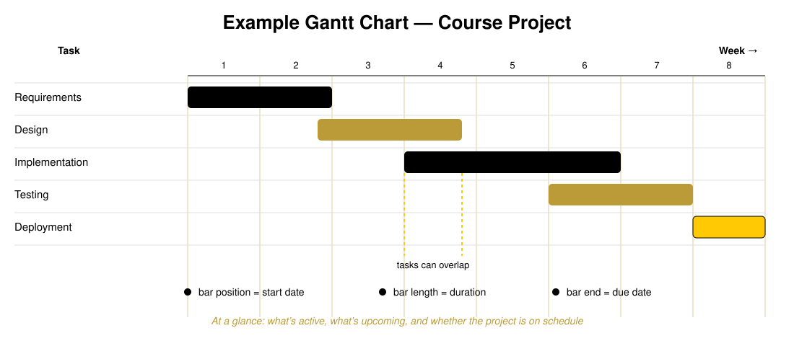
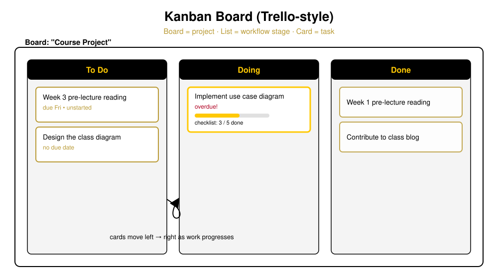
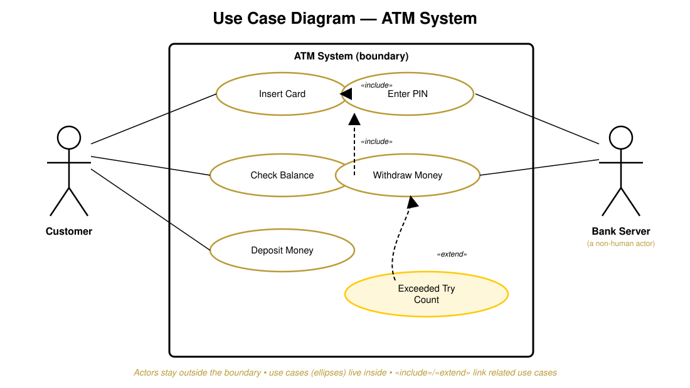
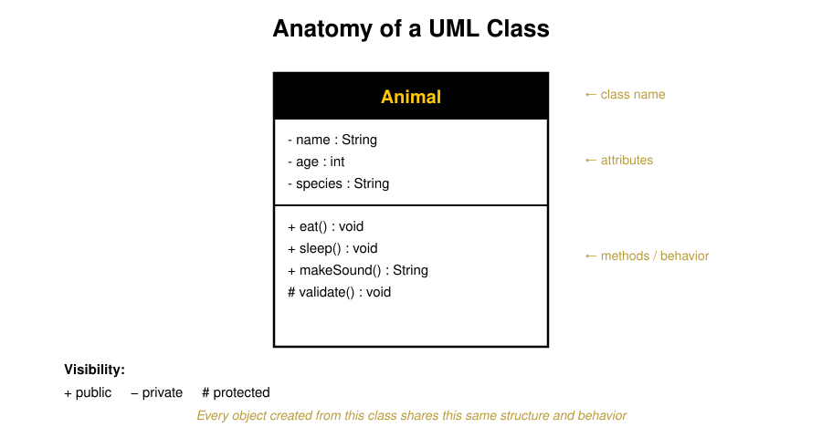
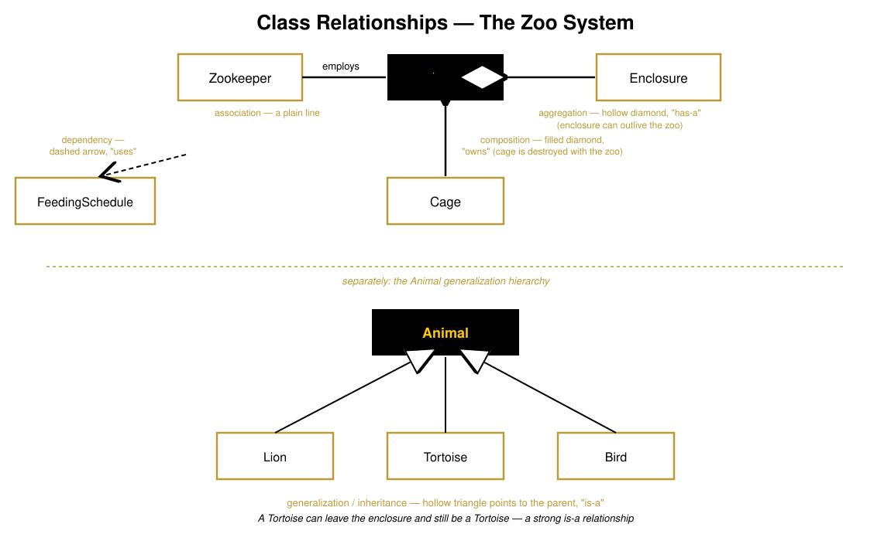
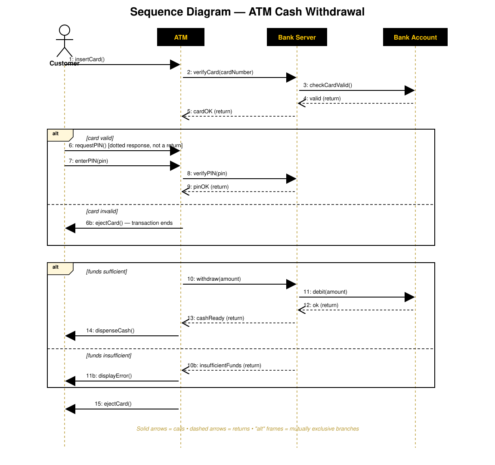
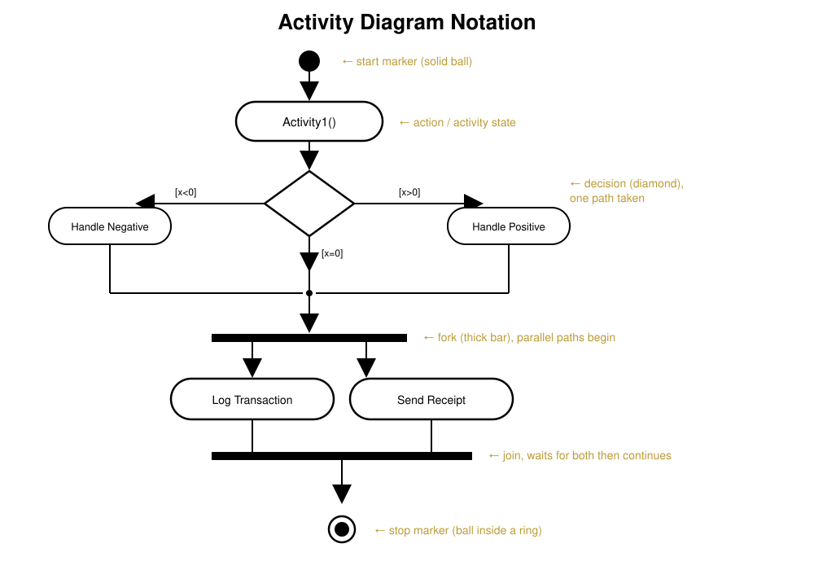
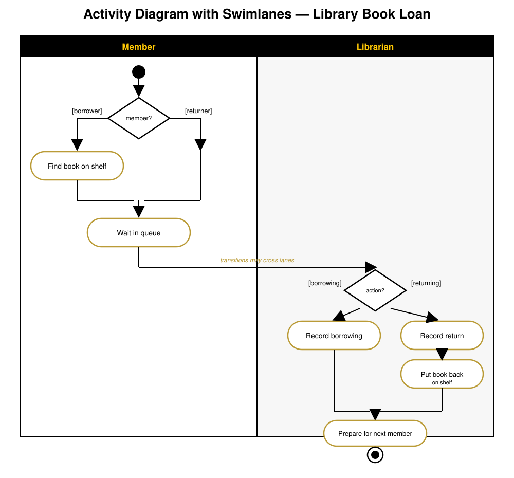

# Modeling Software Projects
### Project-Management Tools & the UML
COP 4331 - University of Central Florida

<small>Based on material by Drs. Richard Leinecker and John Aedo</small>

Note:
Lecture 2 of 2. First half: the non-UML tools we use to plan and track a project (Gantt charts, Kanban boards, Jira/GitHub Issues). Second half: the UML diagrams we use to model the application itself (use case, class, sequence, activity).

---

## Why We Model At All

Before you model the *application*, you have to model the *project*. Two different problems, two different sets of diagrams:

1. **Modeling the work** - Gantt charts, Kanban boards, burndown charts: *when* things happen and *who* is doing them
2. **Modeling the application** - UML: *what* the system does and *how* its parts fit together

Both are about the same thing at heart: creating a shared, visual understanding that a team can agree on before committing to code.

---

# Part 1: Non-UML Tools for Managing the Work

---

## Gantt Charts

A Gantt chart is one of the most popular ways to show activities (tasks or events) displayed against time.

- The **left side** lists the activities
- The **top** is a time scale
- Each activity is a **bar** - its position, length, and end reflect the start date, duration, and end date

At a glance you can see what's active, what's upcoming, how long each task will last, and whether tasks overlap.

---

## Reading a Gantt Chart

When you look at a Gantt chart, you're really asking:

- What tasks are being worked on **now**, and what's **upcoming**?
- When is each task **due**, and what **dependencies** does it have?
- **Who** is doing each task?
- Is the project **late, on time, or ahead** of schedule?

**Common tools:** GanttPro.com, TeamGantt, Excel, LucidChart.io (which can even import a board from Trello)

---

## Kanban Boards & Trello

A **Kanban board** is the digital equivalent of laying sticky notes out on the floor - it's cloud-based, so it can be accessed anywhere, and it's just as useful for a group presentation or a research project as it is for a corporate team.

- **Board** - the project or goal itself
- **List** - a stage in your workflow (typically "To Do," "Doing," "Done")
- **Card** - an actual task that needs to get done

---

## Trello in Practice

Cards carry more than just a title:

- **Due dates** - Trello notifies you by email as a deadline nears
- **Checklists** - track progress within a single card
- **Color labels** - filter down to a specific type of task
- **Attachments** - documents and links for easy reference
- **Interoperability** - connects with other apps (e.g., Evernote)

On a collaborative board, teammates get notified when a card they're assigned to is due; you can also **subscribe** to a card to get updates without being personally assigned.

---

## Beyond Trello: More PM & Issue Tools

| Tool | Best known for |
|---|---|
| **GitKraken / GitKraken Boards** | Git GUI with an integrated Kanban board |
| **Jira** | Sprint boards and reporting, built for **Agile** teams |
| **GitHub Issues** | Lightweight issue tracking tied directly to your repo |

Jira in particular is built around the Agile sprint model - its sprint board looks like a Kanban board, but its reporting is where it earns its reputation.

---

## Burndown Charts

A **burndown chart** is Agile's answer to "are we on track?" It plots **remaining work** against **time remaining in the sprint**.

- The ideal line trends straight down to zero by the sprint's end
- The actual line shows real progress - above the ideal line means the team is behind, below means ahead
- Unlike a Gantt chart (which shows a *schedule*), a burndown chart shows *velocity*

---

# Part 2: Modeling the Application - the UML

---

## Why Model Your Applications?

- Creating models **solidifies design goals** before a line of code is written
- Models provide **design agreement** among development teams
- A visual model **bridges the gap** between stakeholders who think about the system very differently - and gives everyone a common understanding

**Non-UML diagrams still matter in this course too:** Entity-Relation Diagrams, Gantt charts, and (for Agile teams) burndown charts.

---

## The UML Family

UML (**Unified Modeling Language**) isn't one diagram - it's a whole family. This course focuses on four:

- **Use Case Diagram** - what the system does, from the outside
- **Class Diagram** - the static structure of the system's data and behavior
- **Sequence Diagram** - how objects collaborate, over time, to accomplish one task
- **Activity Diagram** - the workflow / control flow of a process

You'll also encounter State Machine, Object, Component, Deployment, Package, Timing, Communication, Composite Structure, and Profile diagrams elsewhere - but these four cover the vast majority of day-to-day modeling.

---

## Use Case Diagrams: The Big Picture

- A Use Case Diagram gives a **high-level snapshot** of an application
- Complex applications need *multiple* use case diagrams, often arranged hierarchically
- They're usually the **best starting point** when communicating with a wide variety of stakeholders - you don't need to be technical to read one

A use case diagram starts with a **boundary** - the edge of the system being modeled.

---

## Actors & the Use Case Diagram

- **Actors** sit *outside* the boundary and are normally drawn as stick figures - but an actor doesn't have to be human. A database or another system counts too.
- **Use cases** live *inside* the boundary, drawn as ellipses with a short verb-phrase description (e.g., "Withdraw Money")
- A straight line connects an actor to every use case it participates in

---

## Use Case Relationships: Include & Extend

- **`<<include>>`** - one use case always triggers another. *Insert Card* always leads into *Enter PIN* - they're related by necessity.
- **`<<extend>>`** - models an **edge case** that only sometimes happens. *Exceeded Try Count* only occurs when PIN entry fails too many times.

Both relationships let you keep the base flow simple while still documenting the exceptions that real systems have to handle.

---

## General Thoughts on UML

For an application to be of **professional quality**, it must:

- Meet the needs of the users
- Be robust
- Be maintainable
- Be documented

Many developers using rapid tools are tempted to skip modeling: write a prototype, then keep bolting on code until it's "done." The problem is that the result lacks a well-defined, scalable architecture - because it was never actually designed. That tends to compromise object-oriented principles and leaves you with code that's inefficient and hard to maintain.

---

## Refine and Reduce Risk

Using UML, a UML-aware tool, and a real development process shifts design work **earlier** - from the development phase into analysis and design.

- This reduces risk and gives you a way to test the architecture *before* coding begins
- The upfront overhead pays off: the system ends up user-driven and documented
- Many UML tools can even generate skeleton code that is efficient, object-oriented, and reusable

---

## Class Diagrams: Notation Basics

A class is drawn as a box with three compartments: **name**, **attributes**, and **methods**. Every object created from the class shares this same structure and behavior.

**Visibility markers:** `+` public    `−` private    `#` protected

---

## Class Relationships: The Zoo System

Classes rarely stand alone - UML gives us five distinct line styles for how they relate:

- **Association** - a plain line connecting two independent classes (e.g., Zoo - employs - Zookeeper)
- **Aggregation** - hollow diamond, a "has-a" relationship where the part can outlive the whole
- **Composition** - filled diamond, an "owns" relationship where the part is destroyed with the whole
- **Generalization / Inheritance** - hollow triangle pointing to the parent, an "is-a" relationship
- **Dependency** - dashed arrow, "uses" - one class relies on another without owning it

Note:
The "tortoise can leave the enclosure and still be a tortoise" line is a nice intuition-check for is-a vs has-a: identity survives the relationship for inheritance, but not necessarily for composition.

---

## Sequence Diagrams: Purpose

A sequence diagram is one of UML's **interaction diagrams** - it describes the dynamic, time-ordered behavior of a set of objects.

Its purposes:
- Model the interactions between objects that realize a single use case
- Verify that a use case can actually be supported by the classes you've designed
- Identify responsibilities/operations and assign them to the right class
- Emphasize the **time ordering** of messages - sequential flow, branching, iteration, even concurrency

---

## Sequence Diagram Notation

- **Lifelines** - a dashed vertical line dropping from each actor/object, representing it existing over time
- **Actors** sit outside the diagram (usually on the far left) and, unlike objects, have no activation box
- **Messages** are horizontal arrows between lifelines:
  - **Solid arrow** = a call
  - **Dashed arrow** = a return
- **Activation boxes** (thin rectangles on a lifeline) show how long an object is actively doing work
- **`alt` frames** wrap around two or more mutually-exclusive branches

---

## Building a Sequence Diagram: ATM Withdrawal

Start with the actor on the left, then add the objects it interacts with, left to right. Add lifelines, then walk the messages downward in time order.

> [!NOTE]
Walk this top-to-bottom live: insert card → verify with the bank → alt: valid/invalid → enter and verify PIN → alt: sufficient/insufficient funds → dispense cash → eject card. Point out that "requestPIN" is not a return message (solid, not dashed) even though it flows back toward the customer.

---

## Alt Frames: Modeling Branches

Notice two things in the ATM diagram:

- A **dashed return arrow** (`4: valid`, `12: ok`) means "I finished the call and I'm handing control back" - it is *not* the same as a new call
- An **`alt` frame** offers two (or more) mutually exclusive paths - only one branch actually executes at runtime, and the diagram documents both so nothing is a surprise later

This is exactly the kind of edge case that a use case diagram's `<<extend>>` hinted at - the sequence diagram is where you work out the *detail* of that edge case.

---

## Activity Diagrams: Purpose

An activity diagram is essentially a **flowchart** for modeling the *dynamic* aspects of a system - usually a business workflow or an operation.

It's especially useful when an operation has to accomplish several things and you need to understand the **dependencies between them** - what can happen in parallel, and what has to finish before something else can start - before you decide on an exact order.

---

## Activity Diagram Notation

- **Action states** are atomic - they can't be broken down further and can't be interrupted
- **Activity states** *can* be decomposed into their own activity diagram, and can be interrupted
- A **branch** has one incoming transition and two or more outgoing ones, each guarded by a Boolean condition like `[x>0]`
- A **fork** starts parallel/concurrent flows; a **join** waits for every incoming flow before continuing

---

## Swimlanes: Assigning Responsibility

A **swimlane** partitions the activities on a diagram into groups, where each group represents the person, role, or department responsible for those activities.

- Each swimlane has a name that's unique within the diagram
- Every activity belongs to **exactly one** swimlane
- But **transitions can cross lanes** - that's exactly how work gets handed off between people

---

## Activity Diagram Example: Library Book Loan

A member either borrows or returns a book; once they reach the front of the queue, responsibility crosses the swimlane boundary to the librarian, who records the transaction and prepares for the next member.

---

## Choosing the Right Diagram

| Diagram | Answers the question&hellip; |
|---|---|
| **Gantt chart** | When does each task happen, and are we on schedule? |
| **Kanban board** | What state is each task in right now? |
| **Use Case Diagram** | What can the system do, from the outside? |
| **Class Diagram** | What are the system's "nouns," and how do they relate? |
| **Sequence Diagram** | In what order do objects talk to each other to get one thing done? |
| **Activity Diagram** | What's the workflow, including branches and parallel work? |

---

## Key Takeaways

- Project **tools** (Gantt, Kanban, Jira/GitHub Issues, burndown charts) model the **work**; **UML** models the **application**
- Use case diagrams start with a **boundary**; actors stay outside it, use cases live inside it
- Class diagrams capture structure through five relationship types: **association, aggregation, composition, generalization, and dependency**
- Sequence diagrams show **time-ordered** collaboration between objects, with `alt` frames for branches
- Activity diagrams are **flowcharts** for workflows, with swimlanes showing who's responsible for what
- Modeling *before* coding shifts risk earlier, where it's cheaper to fix

**Coming up:** we'll put these diagrams to work designing your own course project.
